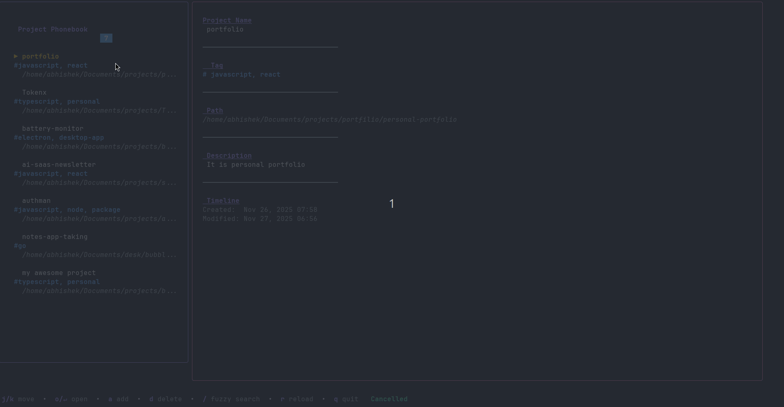

# Project Phonebook

A beautiful, blazingly fast terminal-based project manager built with Go and [Bubble Tea](https://github.com/charmbracelet/bubbletea). Quickly navigate, search, and open your projects from the command line.


<!-- TODO: Add a demo gif showing the TUI in action -->

## Features

- **Fuzzy Search** - Real-time fuzzy finding with intelligent scoring
- **Lightning Fast** - Instant filtering and navigation
- **Beautiful UI** - Modern, colorful terminal interface with intuitive design
- **Project Metadata** - Track project names, paths, tags, and descriptions
- **Tag Support** - Organize projects with custom tags
- **Path Autocomplete** - Tab completion for directory paths when adding projects
- **Vim-style Navigation** - Navigate with j/k keys or arrow keys
- **Auto-sync** - Updates last accessed time when opening projects
- **JSON Storage** - Simple, human-readable project database

## Installation

### Using Go Install
```bash
go install github.com/sah-abhishek/phonebook@latest
```

### From Source
```bash
git clone https://github.com/sah-abhishek/phonebook.git
cd phonebook
go build -o phonebook
sudo mv phonebook /usr/local/bin/
```

<!-- ### Binary Releases -->
<!---->
<!-- Download the latest binary from the [releases page](https://github.com/yourusername/project-phonebook/releases). -->
<!---->
## Usage

Simply run the command:
```bash
phonebook
```

Or if you built from source with a different name:
```bash
./phonebook
```

### Adding Your First Project

1. Press `a` to open the "Add Project" form
2. Fill in the project details:
   - **Name**: Your project name (required)
   - **Path**: Absolute path to the project directory (required)
   - **Tags**: Comma-separated tags (optional)
   - **Description**: Brief description (optional)
3. Use `Tab` for path autocomplete
4. Press `Enter` or navigate to "Submit" button to save

### Searching for Projects

1. Press `/` to activate fuzzy search
2. Start typing - results filter in real-time
3. Use arrow keys or `Ctrl+N`/`Ctrl+P` to navigate results
4. Press `Enter` to open the selected project
5. Press `Esc` to exit search mode

The fuzzy search algorithm intelligently matches:
- Project names
- Tags
- Descriptions
- File paths

And prioritizes:
- Exact substring matches
- Consecutive character matches
- Matches at word boundaries
- Matches in name over tags/descriptions

### Opening Projects

Projects open in your configured editor. By default, the application uses `nvim`, but you can customize this by setting the `EDITOR` environment variable:
```bash
export EDITOR="code"  # VS Code
export EDITOR="nvim"   # NeoVim
export EDITOR="emacs" # Emacs
```

Add this to your `.bashrc`, `.zshrc`, or equivalent shell configuration file.

## Keyboard Shortcuts

### Main View

| Key | Action |
|-----|--------|
| `j` / `Down` | Move cursor down |
| `k` / `Up` | Move cursor up |
| `o` / `Enter` | Open selected project |
| `/` | Start fuzzy search |
| `a` | Add new project |
| `d` | Delete selected project |
| `r` | Reload projects from disk |
| `q` / `Ctrl+C` | Quit application |

### Search Mode

| Key | Action |
|-----|--------|
| Type | Filter projects in real-time |
| `Down` / `Ctrl+N` | Navigate down through results |
| `Up` / `Ctrl+P` | Navigate up through results |
| `Enter` | Open selected project |
| `Esc` | Exit search mode |

### Add Project Form

| Key | Action |
|-----|--------|
| `Tab` | Next field / Path autocomplete |
| `Shift+Tab` / `Up` | Previous field |
| `Down` | Next field |
| `Enter` | Submit (when on Submit button) or next field |
| `Esc` | Cancel and return to main view |

## Configuration

Projects are stored in a JSON file at:
```
~/.config/projects/projects.json
```

### Manual Editing

You can manually edit the projects file. The structure is:
```json
[
  {
    "name": "My Project",
    "path": "/home/user/projects/my-project",
    "tag": "go",
    "description": "A sample Go project",
    "created_at": "2025-01-15T10:30:00Z",
    "updated_at": "2025-01-20T14:45:00Z"
  }
]
```

After manual editing, press `r` in the application to reload.

## How It Works

### Fuzzy Matching Algorithm

The fuzzy search uses a custom scoring algorithm that:

1. Awards highest scores to exact substring matches
2. Gives bonus points for consecutive character matches
3. Prioritizes matches at word boundaries
4. Searches across all project fields (name, tag, description, path)
5. Sorts results by relevance score

### Project Ranking

Projects are normally sorted by last updated time, showing recently accessed projects first. When searching, results are re-ranked by fuzzy match score.

## Requirements

- Go 1.19 or higher
- A terminal with 256-color support
- Unix-like system (Linux, macOS, BSD)

## Dependencies

- [Bubble Tea](https://github.com/charmbracelet/bubbletea) - Terminal UI framework
- [Bubbles](https://github.com/charmbracelet/bubbles) - TUI components
- [Lipgloss](https://github.com/charmbracelet/lipgloss) - Style definitions

## Building
```bash
go mod download
go build -o phonebook
```

For a smaller binary:
```bash
go build -ldflags="-s -w" -o phonebook
```

## Terminal Support

Works best with modern terminal emulators:
- Alacritty
- Kitty
- iTerm2
- Ghostty
- WezTerm
- GNOME Terminal
- Windows Terminal

## Contributing

Contributions are welcome! Please feel free to submit a Pull Request.

1. Fork the repository
2. Create your feature branch (`git checkout -b feature/amazing-feature`)
3. Commit your changes (`git commit -m 'Add some amazing feature'`)
4. Push to the branch (`git push origin feature/amazing-feature`)
5. Open a Pull Request

## License

This project is licensed under the MIT License - see the [LICENSE](LICENSE) file for details.

## Acknowledgments

- Built with [Charm](https://charm.sh/) libraries
- Inspired by project launchers like [projector](https://github.com/omerxx/projector) and similar tools

## Roadmap

- [ ] Export/import projects
- [ ] Project templates
- [ ] Git integration (show branch, status)
- [ ] Recent projects quick access
- [ ] Project grouping/categories
- [ ] Multi-editor support with per-project preferences
- [ ] Shell integration (cd to project)
- [ ] Project statistics (time spent, access frequency)

## Support

If you encounter any issues or have questions:
- Open an issue on [GitHub Issues](https://github.com/sah-abhishek/phonebook/issues)
- Check existing issues for solutions

---

Made with Go and Bubble Tea. Happy coding!
